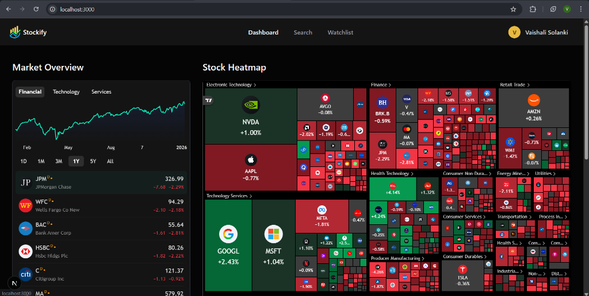
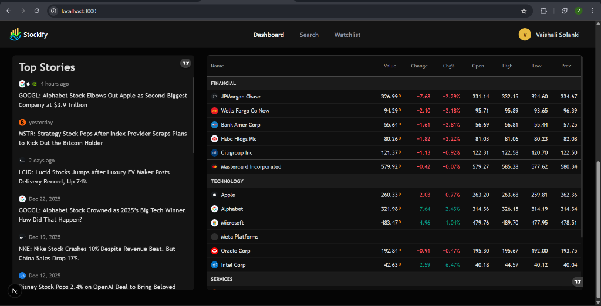
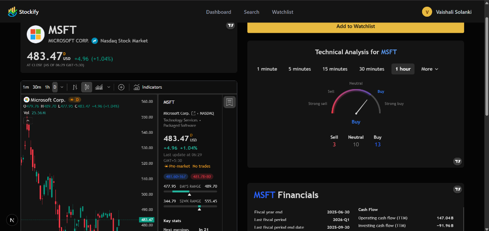
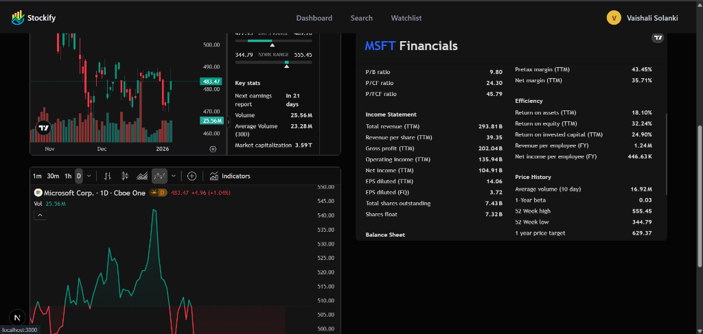

<div align="center">
    <h1 align="center">Stockify — Real-Time Stock Market Tracker</h1>
    <h3 align="center">Alerts, Charts, AI Insights</h3>
</div>

<div align="center"> 
  
  
  
  
  <br/>
  
  
  
</div>

<br/>

## 📋 <a name="table">Table of Contents</a>

1. ✨ [Introduction](#introduction)
2. 🔋 [Features](#features)
3. 📸 [Screenshots](#screenshots)
4. ⚙️ [Tech Stack](#tech-stack)
5. 🤸 [Quick Start](#quick-start)

## <a name="introduction">✨ Introduction</a>

**Stockify** is an AI-powered modern stock market application designed for real-time financial tracking and analysis. Built with the latest web technologies, it offers a seamless experience for monitoring stock prices, visualizing market trends with interactive charts, and receiving personalized AI-driven insights.

Key capabilities include:
- Real-time stock data and comprehensive company profiles.
- Interactive financial charts and heatmaps.
- AI-powered daily news summaries and earnings analysis (powered by **Gemini AI**).
- Automated email alerts for price thresholds and market movements (powered by **Inngest**).
- Secure user authentication and personal watchlist management.

This project demonstrates a robust implementation of event-driven architecture and modern full-stack development practices.

## <a name="features">🔋 Features</a>

👉 **Stock Dashboard**: Track real-time stock prices with interactive line and candlestick charts, filter stocks by industry, performance, or market cap.

👉 **Powerful Search**: Instantly find stocks with an intelligent search system and view detailed company profiles.

👉 **Watchlist & Alerts**: Create personalized watchlists and set custom price alerts to stay ahead of market moves.

👉 **AI-Powered Insights**: Get daily market summaries and earnings report analysis generated by Gemini AI, delivered directly to your inbox.

👉 **Company Deep Dive**: Access detailed financial metrics (PE ratio, EPS, Revenue), recent news, filings, and analyst ratings.

👉 **Event-Driven Workflows**: Automated background jobs for fetching news, processing alerts, and sending emails using Inngest.

## <a name="screenshots">📸 Screenshots</a>

### Dashboard & Market Overview


### Real-Time News & Top Stories


### Detailed Stock Analysis


### Technical Charts & Indicators


## <a name="tech-stack">⚙️ Tech Stack</a>

- **Frontend**: Next.js, React, TailwindCSS, Shadcn UI
- **Backend**: Next.js Server Actions, MongoDB
- **Authentication**: Better Auth
- **AI & Automation**: Inngest (Event-driven workflows), Google Gemini AI
- **Data & APIs**: Finnhub (Market Data), Nodemailer (Email Service)
- **Language**: TypeScript

## <a name="quick-start">🤸 Quick Start</a>

Follow these steps to set up the project locally.

**Prerequisites**

- [Node.js](https://nodejs.org/en) installed
- MongoDB connection string
- API Keys for Finnhub and Gemini

**Installation**

1. Clone the repository:
   ```bash
   git clone https://github.com/yourusername/stockify.git
   cd stockify
   ```

2. Install dependencies:
   ```bash
   npm install
   ```

3. Set up environment variables:
   Create a `.env` file in the root directory and add your credentials:
   ```env
   NODE_ENV='development'
   NEXT_PUBLIC_BASE_URL=http://localhost:3000

   # KEYS
   NEXT_PUBLIC_FINNHUB_API_KEY=your_finnhub_key
   MONGODB_URI=your_mongodb_uri
   BETTER_AUTH_SECRET=your_auth_secret
   GEMINI_API_KEY=your_gemini_key
   NODEMAILER_EMAIL=your_email
   NODEMAILER_PASSWORD=your_app_password
   ```

4. Run the development server:
   ```bash
   npm run dev
   ```

5. Start the Inngest dev server (for background jobs):
   ```bash
   npx inngest-cli@latest dev
   ```

Open [http://localhost:3000](http://localhost:3000) to view the app.
